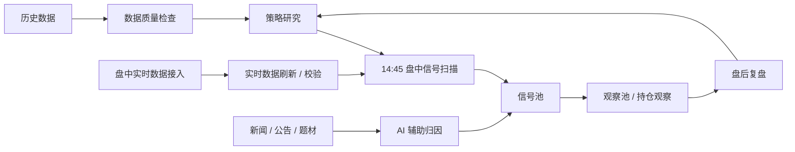

# A-Share AI Quant Workbench Public

> 一个面向 A 股盘中研究的 AI 量化工作台名片仓库。<br>
> 不荐股，不带单，不公开私有策略，仅用于研究交流和共研者筛选。

当前版本：`v0.1.0-public-card`

这个仓库不是完整交易系统，不是荐股项目，也不是自动赚钱工具。

它的目的很简单：公开说明我的研究方向、系统边界、协作方式，以及少量已经脱敏的示例，让真正对 A 股量化研究、数据工程、盘中监测和 AI 辅助复盘感兴趣的人能快速判断是否同频。

English note: this is a public profile repository for research communication only. It is not a stock recommendation project, and private data or strategy logic is not included.

## 脱敏工作台预览


截图已经脱敏。真实行情数据、账户信息、交易记录、私有策略参数和可执行交易逻辑不在本仓库内。

## 研究闭环



## 当前状态

- 本地历史数据层已经在使用中。
- QMT / MiniQMT 盘中数据接入正在实盘流程里测试。
- 盘中实时数据接入、刷新和可用性校验是当前重点整合方向。
- 14:45 信号扫描是当前核心研究窗口。
- 信号池和观察池 / 持仓观察结构正在拆分。
- 影子候选只用于观察，不直接进入实盘执行。
- 系统正在补强“无信号日”的解释能力：市场否决、规则过严、不可买涨停、数据过期、实时行情不可用等。

## 公开策略样例

本仓库公开的策略样例是：**14:45 尾盘信号扫描**。

这个样例不会公开私有阈值、参数或执行规则，只描述工作流层面的思路：

- 在 14:45 附近扫描盘中市场环境。
- 将候选标的先进入信号池，而不是把候选直接等同于可交易。
- 将部分候选移入观察池 / 持仓观察，用于后续验证。
- 盘后复盘时分类：错过、误报、市场否决、数据过期、规则过严等。
- AI 负责辅助归因和复盘记录，不负责最终交易决策。

这个样例的目的，是说明研究闭环，不是提供股票代码、买卖点或交易信号。

## 公开什么

- 系统架构和研究原则。
- 脱敏后的表结构草案。
- mock 数据样例。
- 复盘、归因、策略 postmortem 的提示词模板。
- 公开版路线图。

## 不公开什么

- 真实行情数据库。
- 实盘账户、持仓、交易记录。
- 私有策略参数和完整信号逻辑。
- 第三方数据源 token、券商环境文件、MiniQMT 私有配置。
- 未脱敏的回测明细和真实股票池。

## 适合谁

这个仓库适合会写代码、能处理数据、懂一点 A 股交易机制，并愿意用样本和复盘验证策略假设的人。

私信前建议先看：[协作说明](docs/collaboration.md)。

如果你想找现成股票代码、跟单、带单、稳赚方法或零基础培训，这个仓库不适合。

## 联系与共研

如果你看完这个仓库后仍然觉得方向同频，可以通过下面的微信二维码联系。


添加前建议先准备这几个问题的答案：

- 你现在主要研究 A 股的哪类策略？
- 你会哪些工具？Python / SQL / pandas / DuckDB / QMT / Streamlit 都可以。
- 你过去有没有做过回测、复盘或实盘观察？
- 你更想贡献哪一块：代码、数据、复盘、策略假设、新闻归因、盘口观察？
- 你能接受不荐股、不带单、不公开私有策略，只做验证共研吗？

## 目录

```text
.
├── assets/
│   └── wechat-research-contact-qr.jpg
├── docs/
│   ├── architecture.md
│   ├── research-principles.md
│   ├── collaboration.md
│   └── roadmap.md
├── schema/
│   ├── signal_pool_daily_schema.sql
│   └── watch_positions_schema.sql
├── examples/
│   ├── redacted_dashboard_screenshot.png
│   ├── mock_signal_pool.csv
│   ├── mock_watch_positions.csv
│   └── mock_ui_screenshot.md
├── prompts/
│   ├── news_to_stock_mapping.md
│   ├── daily_review_template.md
│   └── strategy_postmortem_template.md
├── DISCLAIMER.md
├── CHANGELOG.md
├── VERSION
├── .env.example
├── .gitignore
└── LICENSE
```

## License and Usage

本公开仓库仅用于研究交流。

私有交易系统、策略参数、真实数据和执行逻辑不属于本仓库公开范围。

MIT 只覆盖本仓库里的公开文件。不要把任何私有策略、数据库、账户流程或执行逻辑理解为已经开源。
