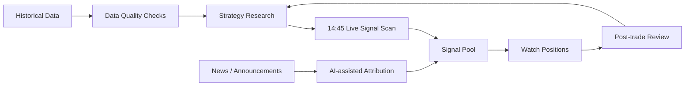

# A-Share AI Quant Workbench Public

> 一个面向 A 股盘中研究的 AI 量化工作台名片仓库。  
> 不荐股，不带单，不公开私有策略，仅用于研究交流和共研者筛选。

This is not a full trading system, not a stock recommendation project, and not an automated money-making tool.

The purpose of this repository is to publicly describe the research direction, system boundary, collaboration style, and a small set of redacted examples.

## Redacted Dashboard Preview


The screenshot is redacted. Real data, account information, trading records, private strategy parameters, and executable trading logic are not included.

## Research Workflow



## Current Status

- Local historical data layer is already in use.
- Intraday QMT / MiniQMT data integration is being tested in the live-market workflow.
- 14:45 signal scanning is the current core research window.
- Signal pool and watch-position structures are being separated.
- Shadow candidates are used for observation only, not for live execution.
- The system is being improved to explain no-signal days: market veto, strict rules, non-buyable limit-up candidates, stale data, or unavailable real-time quotes.

## Public Example Strategy

The public example is a **14:45 tail-session signal scan**.

It does not expose private thresholds or execution rules. The idea is only described at the workflow level:

- Scan the late-session market environment around 14:45.
- Filter candidates into a signal pool instead of treating every candidate as tradable.
- Move selected candidates into watch positions for observation.
- Use post-trade review to classify misses, false positives, market vetoes, and stale-data cases.
- Let AI assist with attribution and review notes, not final trading decisions.

This example is shared to explain the research workflow, not to provide stock picks or trading signals.

## What Is Public

- System architecture and research principles.
- Redacted schema drafts.
- Mock data examples.
- Prompt templates for review, attribution, and strategy postmortems.
- A public roadmap for the card repository.

## What Is Not Public

- Real market databases.
- Real account, position, and trading records.
- Private strategy parameters and complete signal logic.
- Third-party data-source tokens, broker environment files, and MiniQMT private configuration.
- Non-redacted backtest details or real stock pools.

## Who This Is For

This repository is for people who can write code, work with data, understand some market mechanics, and are willing to validate strategy hypotheses with samples and reviews.

See [Collaboration](docs/collaboration.md) before reaching out.

This repository is not for stock tips, copy trading, paid calls, guaranteed returns, or zero-foundation training.

## Repository Layout

```text
.
├── docs/
│   ├── architecture.md
│   ├── research-principles.md
│   ├── collaboration.md
│   └── roadmap.md
├── schema/
│   ├── signal_pool_daily_schema.sql
│   └── watch_positions_schema.sql
├── examples/
│   ├── redacted_dashboard_screenshot.png
│   ├── mock_signal_pool.csv
│   ├── mock_watch_positions.csv
│   └── mock_ui_screenshot.md
├── prompts/
│   ├── news_to_stock_mapping.md
│   ├── daily_review_template.md
│   └── strategy_postmortem_template.md
├── DISCLAIMER.md
├── .env.example
├── .gitignore
└── LICENSE
```

## License and Usage

This public repository is released for research communication only.

The private trading system, strategy parameters, real data, and execution logic are not part of this repository.

MIT can cover the public files in this repository, but do not assume that any private strategy, database, account workflow, or execution logic is open sourced.

