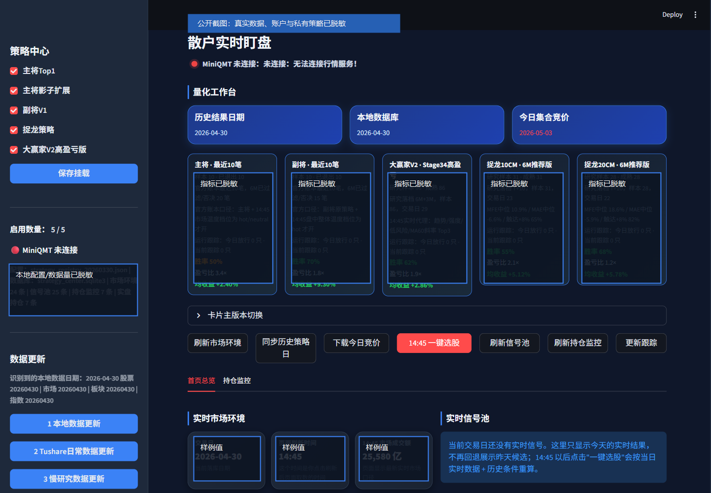

# A-Share AI Quant Workbench Public

一个面向 A 股盘中研究的 AI 量化工作台名片仓库。

这个仓库不是完整交易系统，也不是荐股项目。它用于公开展示研究方向、系统边界和协作方式，帮助找到少数能一起研究策略工程、数据治理、回测验证和复盘归因的人。



## 我们在研究什么

- A 股盘中信号监测，重点关注 14:45 附近的候选信号。
- 策略信号、观察池、持仓观察和复盘记录的结构化落库。
- AI 辅助新闻归因、复盘总结、策略失败分析和研究笔记整理。
- 用 Python、pandas、SQL、DuckDB、SQLite、Streamlit 等工具搭建本地研究闭环。
- 让策略从想法、样本、回测、观察、复盘逐步走向可验证。

## 公开什么

- 系统架构和研究原则。
- 脱敏后的表结构草案。
- mock 数据样例。
- 复盘、归因、策略 postmortem 的提示词模板。
- 公开版路线图。

## 不公开什么

- 真实行情数据库。
- 实盘账户、持仓、交易记录。
- 私有策略参数和完整信号逻辑。
- 第三方数据源 token、券商环境配置、MiniQMT 私有配置。
- 未脱敏的回测明细和真实股票池。

## 适合谁

如果你会写代码、做数据、懂一点交易机制，愿意用样本和复盘验证策略假设，欢迎看 [协作说明](docs/collaboration.md)。

如果你想找现成股票代码、跟单、带单、稳赚方法或零基础培训，这个仓库不适合。

## 目录

```text
.
├── docs/
│   ├── architecture.md
│   ├── research-principles.md
│   ├── collaboration.md
│   └── roadmap.md
├── schema/
│   ├── signal_pool_daily_schema.sql
│   └── watch_positions_schema.sql
├── examples/
│   ├── mock_signal_pool.csv
│   ├── mock_watch_positions.csv
│   └── mock_ui_screenshot.md
├── prompts/
│   ├── news_to_stock_mapping.md
│   ├── daily_review_template.md
│   └── strategy_postmortem_template.md
├── .env.example
├── .gitignore
└── LICENSE
```

## 当前状态

这是一个公开名片仓库。目标不是马上交付完整可运行产品，而是先把研究方向、边界和协作入口讲清楚。
